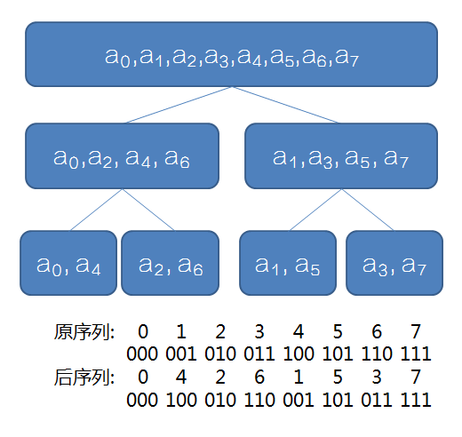

# 算法
## 分治法
### 步骤
``分解(Divide)``

``解决(Conquer)``

``合并(Combine)``
### 应用
+ 最大子数组问题
    
    最大子数组对于区间 A[low,high] 存在三种情况：    
    1. 位于A[low,mid]，分治
    2. 位于A[mid,high],分治
    3. 位于A[i,mid]+A[mid,j],该情况暴力求解即可 
    
    三者中最大值即为所求的解，复杂度O(nlogn)

    >该问题存在线性解法O(n)：动态规划，若已知A[ 1, j ] 的最大子数组，则A[1, j+1]的最大子数组之和要么是A[1, j ],要么是A[i,j]
    \(1=<i<=j\)

    衍伸：求解求解区间中任意两个元素的最大差值（买股票问题），将点的差值利用逐差法转化为求解区间和最大值。
+ 逆序对问题nlog(n)
  类似于归并排序，此外该问题还有树状数组这种解法。

树状数组解法(nlog(n))：
思路：<br />
对于一个从1-n的乱序数组来说，第i个数字x两个信息就可以计算出和该数字相关联的逆序对个数。
假设我们已知第i个数字前小于x的数字个数为sum，
则 i - 1 - sum表示前面比数字x大的数字个数；
x - 1 - sum表示本应该在前面出现的比x小的数字个数(即比x小的数字出现在后面)。
两者个数之和就是该数字的所有相关联逆序对个数。
那么sum怎么求呢？
我们可以通过树状数组记录，每次完成后对数字记录为1，表示该数字已出现过，sum则只需要求和即可。 
```cpp
#include <iostream>

const int MAXN = 1e6+10;

inline int read()
{
    char c=getchar();int x=0,f=1;
    while(c<'0'||c>'9'){if(c=='-')f=-1;c=getchar();}
    while(c>='0'&&c<='9'){x=x*10+c-'0';c=getchar();}
    return x*f;
}
struct BIT{
    int t[MAXN];
    int n;
    static int lowbit(int x){return x&(-x);}
    void init(int _n)
    {
        n=_n;
        for(int i=0;i<=n;++i)t[i] = 0;
    }

    void add(int i,int x)
    {
        while(i<=n)
        {
            t[i]+=x;
            i+=lowbit(i);
        }
    }

    int sum(int i){
        int ans=0;
        while(i>0){
            ans+=t[i];
            i-=lowbit(i);
        }
        return ans;
    }

    int sum(int i,int j){
        if(i>j)return 0;
        return sum(j)-sum(i-1);
    }
};

int n;
BIT tag;
int ans[MAXN];

int main(){
    n = read();tag.init(n);
    int x, sum;

    for(int i=1;i<=n;++i){
        x = read();
        sum = tag.sum(x);
//        printf("%d %d\n",sum, i - 1 - sum);
        ans[x] = (x - 1 - sum) + (i - 1 - sum);
        tag.add(x, 1);
    }
    for(int i=1;i<=n;++i)printf("%d ",ans[i]);
    return 0;
}

```
+ 二进制数乘法Olog(n)
  利用分治法常用公式
  $$\begin{aligned}
      ab &= (2^{\frac{n}{2}}a_1+a_2)(2^{\frac{n}{2}}b_1+b_2)\\
      &= 2^{n}a_1b_1 +2^{\frac{n}{2}}(a_1b_2 + a_2b_1) + a_2b_2\\
       &= 2^{n}a_1b_1 +2^{\frac{n}{2}}((a_1 + a_2)(b_1 + b_2) - a_1b_1 - a_2b_2) + a_2b_2
  \end{aligned}$$
  只需要分治3个乘法计算即可。
+ 第k大问题
  快排思想
+ 欧式距离最近点问题
  类似最大子数组问题解法，左右+中间
### fft快速傅里叶
#### 多项式
1. 系数表示法
   &emsp;&emsp;~~就是数学课上的学不会的表达形式。~~
2. 点值表示法
   &emsp;&emsp;一个n次多项式可以用任意$(x_0, f(x_0)),(x_1, f(x_1))...(x_n, f(x_n))$共`n+1`个不同的点唯一表示。
#### 复数
> 为方便分析，默认n为2的正整数次幂
> 
&emsp;&emsp;首先定义$\omega_n$为复数平面上的n次单位根，满足
$$w^n_n = w^0_n = 1$$
$w^k_n$在复平面上就是一个模为1，幅角为$k\frac{2\pi}{n}$的向量。根据欧拉公式，我们可以表示为
$$w^k_n = cos(k\frac{2\pi}{n})+sin(k\frac{2\pi}{n})i$$
容易导出单位根存在以下两个`重要性质`：
+ $\omega^{2k}_{2n} = \omega^{k}_{n}$
+ $\omega^{k}_{n} = -\omega^{k+\frac{n}{2}}_{n}$
#### 分治法计算点值表示法
$$A(x) = a_0+a_1x+...+a_nx^n$$
按照宇称性(~~其实就是奇偶性~~)我们可以变换为
$$\begin{aligned}
A(x) &= (a_0+a_2x^2+...+a_nx^n) + (a_1x+a_3x^3+...+a_{n-1}x^{n-1})\\
&=A_1(x^2)+xA_2(x^2) 
\end{aligned}$$
根据上述表达式，我们发现了两个技巧：
+ $A_1(x^2)$和$A_2(x^2)$同样可以继续分治，直到只剩常数项$a_0$
+ 对于一个n-1次多项式，原本需要计算n个点值，但在下面推导中，我们发现只需要计算一半的点就可以直接获得另外一半点的结果！
  $$\begin{aligned}
  A(\omega^k_n) &= A_1(\omega^{2k}_n) + \omega^k_nA_2(\omega^{2k}_n)
  \end{aligned}$$
  $$\begin{aligned}
  A(\omega^{k+\frac{n}{2}}_n) &= A_1(\omega^{2k+n}_n) + \omega^{k+\frac{n}{2}}_nA_2(\omega^{2k+n}_n) \\
  &= A_1(\omega^{2k}_{n}*\omega^{n}_{n}) - \omega^k_nA_2(\omega^{2k}_{n}*\omega^{n}_{n}) \\
  &= A_1(\omega^{2k}_n) - \omega^k_nA_2(\omega^{2k}_n)
  \end{aligned}$$
#### fft递归实现
&emsp;&emsp;利用好上述分析的两点，我们可以很容易的写出递归计算方法。
```cpp
#include<cstdio>
#include<cmath>
using namespace std;
const int MAXN = 4 * 1e6 + 10;
inline int read() {
    char c = getchar(); int x = 0, f = 1;
    while (c < '0' || c > '9') {if (c == '-')f = -1; c = getchar();}
    while (c >= '0' && c <= '9') {x = x * 10 + c - '0'; c = getchar();}
    return x * f;
}
const double Pi = acos(-1.0);
struct complex {
    double x, y;
    complex (double xx = 0, double yy = 0) {x = xx, y = yy;}
} a[MAXN], b[MAXN];
complex operator + (complex a, complex b) { return complex(a.x + b.x , a.y + b.y);}
complex operator - (complex a, complex b) { return complex(a.x - b.x , a.y - b.y);}
complex operator * (complex a, complex b) { return complex(a.x * b.x - a.y * b.y , a.x * b.y + a.y * b.x);} //不懂的看复数的运算那部分
void fast_fast_tle(int limit, complex *a, int type) {
    if (limit == 1) return ; //只有一个常数项
    complex a1[limit >> 1], a2[limit >> 1];
    for (int i = 0; i <= limit; i += 2) //根据下标的奇偶性分类
        a1[i >> 1] = a[i], a2[i >> 1] = a[i + 1];
    fast_fast_tle(limit >> 1, a1, type);
    fast_fast_tle(limit >> 1, a2, type);
    complex Wn = complex(cos(2.0 * Pi / limit) , type * sin(2.0 * Pi / limit)), w = complex(1, 0);
    //Wn为单位根，w表示幂
    for (int i = 0; i < (limit >> 1); i++, w = w * Wn) //这里的w相当于公式中的k
        a[i] = a1[i] + w * a2[i];
        a[i + (limit >> 1)] = a1[i] - w * a2[i]; //利用单位根的性质，O(1)得到另一部分
}
int main() {
    int N = read(), M = read();
    for (int i = 0; i <= N; i++) a[i].x = read();
    for (int i = 0; i <= M; i++) b[i].x = read();
    int limit = 1; while (limit <= N + M) limit <<= 1;
    fast_fast_tle(limit, a, 1);
    fast_fast_tle(limit, b, 1);
    //后面的1表示要进行的变换是什么类型
    //1表示从系数变为点值
    //-1表示从点值变为系数
    //至于为什么这样是对的，可以参考一下c向量的推导过程，
    for (int i = 0; i <= limit; i++)
        a[i] = a[i] * b[i];
    fast_fast_tle(limit, a, -1);
    for (int i = 0; i <= N + M; i++) printf("%d ", (int)(a[i].x / limit + 0.5)); //按照我们推倒的公式，这里还要除以n
    return 0;
}
```
#### fft迭代实现
&emsp;&emsp;递归的算法常数项太大了，由于fft递归本质上只用到了从叶子结点向上的计算过程，因此，我们可以用填表的方式，直接迭代模拟递归算法的后半部分。
&emsp;&emsp;首先借用一下这张图：

迭代过程中用到的几个技巧：
+ 不难发现，`最底层需要计算的元素序号本质上是编号的二进制反转`！编号二进制反转的算法如下
    ```cpp
    for(int i = 0;i < limit; ++i)
        rev[i] = (rev[i >> 1] >> 1) | ((i & 1) << (bitNum - 1));
    ```
    交换最底层元素
    ```cpp
    for(int i = 0;i < limit;++i)
    {
        // 避免重复交换
        if(i < rev[i])swap(A[i], A[rev[i]]);
    }
    ```
+ 我们可以将计算过程分为第i层第j组上的计算。如图中例子共三层，第$i$层长度为$2i$；第1层共有4组，每一组就代表了递归函数中当前计算的$A(x)$，因此需要遍历当前组中的一半元素，按照之前的推导，另一半可以直接求得。因此迭代组成如下：
    ```cpp
    // 第i层
    for(int halfLen = 1;halfLen < limit; halfLen <<= 1)
    {
        int len = halfLen << 1;
        cp wn = cp(cos(PI / halfLen), flag * sin(PI / halfLen));
        // 第j组
        for(int i = 0;i < limit;i += len)
        {
            cp w = cp(1, 0);
            // 遍历每一组中需要计算的一半元素
            for(int k = i;k < i + halfLen;++k, w = w * wn)
            {
                // 蝴蝶操作
                cp A1 = A[k], A2 = w * A[k + halfLen];
                A[k] = A1 + A2;
                A[k + halfLen] = A1 - A2;
            }
        }
    }
    ```

#### FFT完整算法
```cpp
#include <iostream>
#include <cmath>
using namespace std;
const int MAXN = 1e6 + 10;
const double PI = acos(-1);
inline int read()
{
    char c=getchar();int x=0,f=1;
    while(c<'0'||c>'9'){if(c=='-')f=-1;c=getchar();}
    while(c>='0'&&c<='9'){x=x*10+c-'0';c=getchar();}
    return x*f;
}

struct cp{
    double x, y;
    cp(double _x = 0, double _y = 0):x(_x), y(_y){};
}a[MAXN], b[MAXN];
cp operator + (cp a, cp b){return cp(a.x + b.x, a.y + b.y);}
cp operator - (cp a, cp b){return cp(a.x - b.x, a.y - b.y);}
cp operator * (cp a, cp b){return cp(a.x * b.x - a.y * b.y , a.x * b.y + a.y * b.x);}

int N, M, limit, bitNum;
int rev[MAXN];
void init(){
    bitNum = 0;
    while((1 << bitNum) <= N + M)++bitNum;
    limit = 1 << bitNum;

    for(int i = 0;i < limit; ++i)
        rev[i] = (rev[i >> 1] >> 1) | ((i & 1) << (bitNum - 1));
}
void fft(cp* A, int flag)
{
    for(int i = 0;i < limit;++i)
    {
        if(i < rev[i])swap(A[i], A[rev[i]]);
    }
    for(int halfLen = 1;halfLen < limit; halfLen <<= 1)
    {
        int len = halfLen << 1;
        cp wn = cp(cos(PI / halfLen), flag * sin(PI / halfLen));
        for(int i = 0;i < limit;i += len)
        {
            cp w = cp(1, 0);
            for(int k = i;k < i + halfLen;++k, w = w * wn)
            {
                cp A1 = A[k], A2 = w * A[k + halfLen];
                A[k] = A1 + A2;
                A[k + halfLen] = A1 - A2;
            }
        }
    }
    if(flag == -1){
        for(int i = 0;i < limit;++i){
            A[i].x /= limit;
            A[i].y /= limit;
        }
    }
}
int main(){
    N = read(), M = read();
    for(int i = 0;i <= N;++i)a[i].x = read();
    for(int i = 0;i <= M;++i)b[i].x = read();
    init();
    fft(a, 1);fft(b, 1)
    for(int i = 0;i <= limit;++i)a[i] = a[i] * b[i];
    fft(a, -1);
    for (int i = 0;i <= N + M;++i)
        printf("%d ", int(a[i].x + 0.5));
    return 0;
}

// 参考 自为风月马前卒 https://www.cnblogs.com/zwfymqz/p/8244902.html
```
#### 常数2/3优化
&emsp;&emsp;~~你以为这就完了么，还有更丧心病狂的常数优化！~~若计算两个多项式相乘，正常来说，需要进行共三次fft的过程（对a FFT，对b FFT，对相乘结果IFFT）。但是我们通过复数下面的性质，我们只需要进行两次fft的过程：
$$
(a+bi)^2 = a^2-b^2 + 2abi
$$
当我们把b放在a的虚数部分上，计算fft，并平方，然后逆变换回来后，只需要取出计算结果的虚数部分除以2就是ab相乘的结果！
```cpp
int main(){
    N = read(), M = read();
    for(int i = 0;i <= N;++i)a[i].x = read();
    for(int i = 0;i <= M;++i)a[i].y = read();
    init();
    fft(a, 1);
    for(int i = 0;i <= limit;++i)a[i] = a[i] * a[i];
    fft(a, -1);
    for (int i = 0;i <= N + M;++i)
        printf("%d ", int(a[i].y / 2 + 0.5));
    return 0;
}
```
#### 模板
```cpp
#include <iostream>
#include <cmath>
using namespace std;
const int MAXN = 1e6 + 10;
const double PI = acos(-1);
inline int read()
{
    char c=getchar();int x=0,f=1;
    while(c<'0'||c>'9'){if(c=='-')f=-1;c=getchar();}
    while(c>='0'&&c<='9'){x=x*10+c-'0';c=getchar();}
    return x*f;
}

struct cp{
    double x, y;
    cp(double _x = 0, double _y = 0):x(_x), y(_y){};
}a[MAXN];
cp operator + (cp a, cp b){return cp(a.x + b.x, a.y + b.y);}
cp operator - (cp a, cp b){return cp(a.x - b.x, a.y - b.y);}
cp operator * (cp a, cp b){return cp(a.x * b.x - a.y * b.y , a.x * b.y + a.y * b.x);}

int N, M, limit, bitNum;
int rev[MAXN];
void init(){
    bitNum = 0;
    while((1 << bitNum) <= N + M)++bitNum;
    limit = 1 << bitNum;

    for(int i = 0;i < limit; ++i)
        rev[i] = (rev[i >> 1] >> 1) | ((i & 1) << (bitNum - 1));
}
void fft(cp* A, int flag)
{
    for(int i = 0;i < limit;++i)
    {
        if(i < rev[i])swap(A[i], A[rev[i]]);
    }
    for(int halfLen = 1;halfLen < limit; halfLen <<= 1)
    {
        int len = halfLen << 1;
        cp wn = cp(cos(PI / halfLen), flag * sin(PI / halfLen));
        for(int i = 0;i < limit;i += len)
        {
            cp w = cp(1, 0);
            for(int k = i;k < i + halfLen;++k, w = w * wn)
            {
                cp A1 = A[k], A2 = w * A[k + halfLen];
                A[k] = A1 + A2;
                A[k + halfLen] = A1 - A2;
            }
        }
    }
    if(flag == -1){
        for(int i = 0;i < limit;++i){
            A[i].x /= limit;
            A[i].y /= limit;
        }
    }
}
int main(){
    N = read(), M = read();
    for(int i = 0;i <= N;++i)a[i].x = read();
    for(int i = 0;i <= M;++i)a[i].y = read();
    init();
    fft(a, 1);
    for(int i = 0;i <= limit;++i)a[i] = a[i] * a[i];
    fft(a, -1);
    for (int i = 0;i <= N + M;++i)
        printf("%d ", int(a[i].y / 2 + 0.5));
    return 0;
}

```
## KMP算法
### 代码实现
```
int KMP(string& Source,string& Target)
{
    int * next=new int[Target.length()];
    int i,j;

    //next数组的创建
    next[0]=-1;
    for(i=1;i<Target.length();++i)
    {
        j=i-1;
        while(j>=0&&Target[next[j]+1]!=Target[i])j=next[j];
        if(j<0)next[i]=-1;
        else next[i]=next[j]+1;

    }

    //开始匹配
    i=j=0;
    while(i<Source.length()&&j<Target.length())
    {
        if(Source[i]==Target[j])++i,++j;
        else if(j==0)++i;
        else j=next[j-1]+1;
    }


    delete []next;
    if(Target.length()==j)return i-j;
    else return -1;
}
```
### 实现思路
通过next数组记录Target字符串首位重复的字母位置，从而在和Source字符串比较的时候通过跳跃来减少比较的次数。
其中，j=next[j]是关键步骤，俗称“回退”。<font color=whiteblue>在构建next数组中，该操作的含义是：如果第i个字符和前一个字符的对称重复位置的下一个不相同，则让j变成目前尾部区间的对称尾部区间（重点需要思考！）next数组的含义是理解本操作的关键点。</font>

